# ICONOCRACIA — Plano de Prioridades
**Data:** 2026-04-15  
**Horizonte:** Qualificação nov/2027 (19 meses)  
**Capacidade:** 4–5h/dia  
**Velocidade estimada:** 800–1.500 palavras/dia (4 dias úteis/semana)

---

## Diagnóstico Real — O Que Existe de Fato

### Prosa já escrita (localização real)

| Peça | Arquivo | Palavras reais |
|------|---------|----------------|
| Introdução | `tese/manuscrito/Introducao_rev.md` | ~5.300 |
| Cap. 1 | `tese/manuscrito/Capitulo1_rev.md` | ~3.300 |
| Cap. 2 (vault — Iconocracia) | `vault/tese/capitulo-2.md` | ~620 |
| Cap. 2 (manuscrito — Metodologia) | `tese/manuscrito/Capitulo2_metodologia.md` | ~3.500 |
| **Total prosa existente** | | **~12.720** |

> **ATENÇÃO:** `Capitulo2_metodologia.md` não é Cap. 2 da tese — é material para **Caps. 4–5**
> (protocolo IconoCode, 10 indicadores, validação, composição do corpus, infraestrutura).
> O arquivo está mal nomeado. Precisa ser integrado em Caps. 4–5.

### Material de reciclagem — artigos → capítulos

| Artigo | Palavras | Status | → Cap(s) |
|--------|----------|--------|-----------|
| Imagens da Nação (c/ Dal Ri Jr.) | ~10.176 | v2, revisão substancial | 2, 7 |
| O contrato visual | ~5.703 | v3 revisado | 1, 2 |
| Vrouwe Justitia não é uma mulher | ~5.830 | v4 revisado | 2, 4, 5 |
| Maria, Marianne e a República | ~6.179 | v3 revisado | 3, 7 |
| A Materialidade do Indeterminado | ~4.863 | v3 revisado | 2, 4, 7 |
| Iconocracia Tropical | ~4.039 | v3 — **track changes** | 1, 2, 3 |
| O Silêncio da Justiça | ~2.684 | sem frontmatter | 2, 5, 7 |
| **Total** | **~39.474** | | |

### Dados técnicos prontos

| Item | Estado |
|------|--------|
| 4 notebooks Jupyter (01–04) | **Executados** — Cap. 6 coberto integralmente |
| IRR `irr_sample.json` | 30 itens definidos — `compute_irr.py` aguarda execução |
| `Capitulo2_metodologia.md` | ~3.500 palavras → Caps. 4–5 |
| Corpus 145 itens | `corpus-data.json` modificado, **não commitado** |
| `references.bib` | +368 linhas, **não commitado** |

---

## Três Insights que Mudam as Prioridades

**1. Cap. 6 está praticamente pronto.** Os 4 notebooks executados cobrem §6.1–§6.4 integralmente.
A tarefa é narração de resultados, não pesquisa. Estimativa real: 2–3 semanas.

**2. Caps. 4–5 já têm ~3.500 palavras** em `Capitulo2_metodologia.md`. Com os artigos
Vrouwe Justitia + A Materialidade, as 20.000 palavras alvo são atingíveis em 6–8 semanas.

**3. Cap. 3 é o único gargalo real.** Zero prosa. Referencial novo necessário (Lélia Gonzalez,
McClintock, Yuval-Davis — ausentes em todos os artigos). Requer pesquisa antes de escrever.

---

## Horizonte 0 — Desbloqueios (semana 1 — até 22/abr/2026)

| # | Ação | Tempo | Comando |
|---|------|-------|---------|
| 1 | **Git commit** — `corpus-data.json` + `references.bib` + candidatos SCOUT | 30 min | `git add corpus/ vault/tese/references.bib && git commit` |
| 2 | **Limpar track changes** em `Iconocracia_Tropical.md` | 1–2h | Editor |
| 3 | **Executar IRR** — amostra já definida, script pronto | 2–4h | `conda run -n iconocracy python tools/scripts/compute_irr.py` |
| 4 | **Verificar pendência** Cap. 1 linha 93: `[VERIFICAR: Goodrich Imago Decidendi 2017]` | 30 min | Zotero |

---

## Horizonte 1 — Ganhos Rápidos (abr–jul 2026, ~14 semanas)

### 1A. Cap. 6 — Análise Quantitativa (meta: 12.000 palavras)
Material: notebooks executados. Tarefa: narrar resultados para prosa acadêmica.

| Semanas | Seção | Fonte |
|---------|-------|-------|
| 1–2 | §6.1 Descritivas N=145 | `01_exploratory.ipynb` |
| 3–4 | §6.2 Kruskal-Wallis por indicador | `02_kruskal_wallis.ipynb` |
| 5–6 | §6.3 Regressão OLS R²=0.49 | `03_regression.ipynb` |
| 7–8 | §6.4 MCA — famílias transatlânticas | `04_correspondence.ipynb` |
| 9–10 | §6.5 Síntese + limitações | Integração |

### 1B. Caps. 4–5 — Método e Corpus (meta: 20.000 palavras)

| Semanas | Peça | Fonte |
|---------|------|-------|
| 3–5 | Cap. 4 §4.1–4.3 IconoCode + indicadores | `Capitulo2_metodologia.md` §2.1–2.3 |
| 6 | Cap. 4 §4.4 montagem warburguiana | `Vrouwe Justitia` §4; `A Materialidade` §4.3 |
| 7–9 | Cap. 5 §5.1–5.3 corpus + infraestrutura | `Capitulo2_metodologia.md` §2.5–2.7 |
| 10–11 | Cap. 5 §5.4 validação + IRR (usar saída do H0 #3) | output `compute_irr.py` |

**Ação de refatoração associada:** integrar `tese/manuscrito/Capitulo2_metodologia.md`
→ `vault/tese/capitulo-4.md` e `vault/tese/capitulo-5.md`.

### 1C. Cap. 2 — Iconocracia (meta: 15.000 palavras)
Em paralelo com 1B. Material de reciclagem abundante (~33k disponíveis para 15k).

| Seção | Fonte principal |
|-------|----------------|
| §2.1 Mondzain e a economia do ícone | `capitulo-2.md` §2.1 + `Imagens da Nação` teórico |
| §2.2 Feminilidade de Estado | `capitulo-2.md` §2.2 + `Vrouwe Justitia` §2 |
| §2.3 Três regimes iconocráticos | `capitulo-2.md` §2.3 + `Imagens da Nação` regimes |
| §2.4 Pathosformel jurídico | `capitulo-2.md` §2.4 + `A Materialidade` §2 |

---

## Horizonte 2 — Publicações + Gargalo Teórico (ago–dez 2026)

### Publicações

| Fase | Artigo | Periódico-alvo | Prazo |
|------|--------|---------------|-------|
| 2A | Maria, Marianne (nota 80) | Sequência ou Direito & Práxis | ago/2026 |
| 2A | A Materialidade (nota 79) | Revista Direito GV | set/2026 |
| 2B | O contrato visual (nota 78, expandido) | Revista Direito GV / Seqüência | out/2026 |
| 2B | Vrouwe Justitia (nota 76, expandido) | Feminist Legal Studies / Rechtsgeschichte | out/2026 |
| 2B | Iconocracia Tropical (após limpeza) | RBSD / Seqüência | nov/2026 |
| 2C | Imagens da Nação (nota 68, c/ Dal Ri Jr.) | revisão substancial | 2º sem/2026 |

**Ação transversal antes de 2A:** parágrafo racial (Lélia Gonzalez, McClintock) em
*O contrato visual* e *Vrouwe Justitia* — ausente em 6/6 artigos no peer review.

### Cap. 3 — Colonialidade do Ver (meta: 12.000 palavras)

| Etapa | Ação | Prazo |
|-------|------|-------|
| Pesquisa | Lélia Gonzalez, McClintock *Imperial Leather*, Yuval-Davis *Gender & Nation*, Mignolo, Mbembe | ago–set/2026 |
| Fichamentos | Notas Obsidian por autor; mapeadas para §3.1–3.4 | set/2026 |
| Rascunho §3.1–3.2 | Universalidade como operação colonial; Marianne → Aparecida | out/2026 |
| Rascunho §3.3–3.4 | Contrato Racial Visual; Brasil como caso paradigmático | nov–dez/2026 |

Reciclagem parcial disponível: *Maria, Marianne* (~2.000 p.) + *Iconocracia Tropical* (~1.500 p.).

---

## Horizonte 3 — Convergência para Qualificação (jan–out 2027)

| Período | Entrega |
|---------|---------|
| jan–mar/2027 | Cap. 1 expandido: 3.300 → 12.000 palavras |
| abr–jun/2027 | Cap. 3 finalizado: 12.000 palavras |
| jul–ago/2027 | Cap. 7 esboço: 8.000 palavras (casos selecionados via Cap. 6) |
| set–out/2027 | Projeto de tese atualizado para banca de qualificação |
| **nov/2027** | **QUALIFICAÇÃO** |

---

## Projeção Numérica

| Ritmo | Palavras/semana | Semanas para meta (~57k novas) | Chegada |
|-------|----------------|-------------------------------|---------|
| Conservador (800/dia × 4) | 3.200 | 18 | set/2026 |
| Realista (1.200/dia × 4) | 4.800 | 12 | jul/2026 |
| Ótimo (1.500/dia × 5) | 7.500 | 8 | jun/2026 |

A meta de qualificação é atingível até **meados de 2026** só com material existente
(Caps. 2, 4, 5, 6). Cap. 3 + Cap. 7 esboço levam até nov/2027 — com folga.

---

## Checklist de Desbloqueio Imediato

```
[ ] 1. git commit: corpus-data.json + references.bib + candidatos vault
[ ] 2. Limpar track changes: vault/tese/rascunhos-artigos/Iconocracia_Tropical.md
[ ] 3. conda run -n iconocracy python tools/scripts/compute_irr.py
[ ] 4. Verificar Goodrich 2017 (nota em tese/manuscrito/Capitulo1_rev.md:93)
[ ] 5. Integrar Capitulo2_metodologia.md → vault/tese/capitulo-4.md + capitulo-5.md
```

---

## Riscos e Mitigações

| Risco | Prob. | Mitigação |
|-------|-------|-----------|
| Cap. 3 bloqueia Parte I para qualificação | Alta | Iniciar fichamentos em ago/2026; não esperar Cap. 2 acabar |
| Corpus 145 vs. meta 300 | Média | Documentar saturação teórica em Cap. 5 §5.4 |
| Imagens da Nação requer co-revisão com orientador | Média | Priorizar artigos solos; coordenar Imagens da Nação à parte |
| iconocracy-ingest com testes deletados | Baixa | Não é caminho crítico; resolver após qualificação |
| Sprint 1 companion app (não iniciado) | Baixa | Adiar para pós-Cap. 3 (fev/2027+) |

---

## Arquivos Críticos

| Arquivo | Próxima ação |
|---------|-------------|
| `tese/manuscrito/Capitulo1_rev.md:93` | Verificar referência Goodrich 2017 |
| `tese/manuscrito/Capitulo2_metodologia.md` | Integrar em Caps. 4–5 |
| `vault/tese/capitulo-2.md` | Expandir 620 → 15.000 palavras |
| `vault/tese/rascunhos-artigos/Iconocracia_Tropical.md` | Limpar track changes |
| `corpus/corpus-data.json` | **Commit urgente** |
| `vault/tese/references.bib` | **Commit urgente** (+368 linhas) |
| `data/processed/irr_sample.json` | Executar `compute_irr.py` |
| `notebooks/01_exploratory.ipynb` → `04_correspondence.ipynb` | Narrar em Cap. 6 |

---

## Mapeamento Visual da Arquitetura

```mermaid
graph TD
    %% Cores e Estilos
    classDef artigo fill:#f9f0ff,stroke:#d0bfff,stroke-width:2px;
    classDef capDone fill:#e6ffed,stroke:#b3ffc4,stroke-width:2px;
    classDef capDraft fill:#fff8c4,stroke:#ffe270,stroke-width:2px;
    classDef capEmpty fill:#ffe6e6,stroke:#ffb3b3,stroke-width:2px;
    
    %% Artigos Fonte
    subgraph Artigos["Material de Reciclagem (~39.5k palavras)"]
        A1["Imagens da Nação"]:::artigo
        A2["Maria, Marianne"]:::artigo
        A3["O contrato visual"]:::artigo
        A4["Vrouwe Justitia"]:::artigo
        A5["A Materialidade"]:::artigo
        A6["Iconocracia Tropical"]:::artigo
        A7["O Silêncio da Justiça"]:::artigo
    end

    %% Capítulos
    subgraph Parte1["Parte I: Teoria (Caps 1-3)"]
        C1["Cap 1: Genealogia (~3.3k)"]:::capDraft
        C2["Cap 2: Iconocracia (~620p)"]:::capDraft
        C3["Cap 3: Colonialidade do Ver (Gargalo - 0p)"]:::capEmpty
    end

    subgraph Parte2["Parte II: Empiria (Caps 4-6)"]
        C4["Cap 4: O Panteão"]:::capDraft
        C5["Cap 5: A República"]:::capDraft
        C6["Cap 6: A Toga (Notebooks executados)"]:::capDraft
    end
    
    %% Material Antigo (Metodologia)
    M1["Capitulo2_metodologia.md (~3.5k)"]:::capDraft

    %% Relacionamentos
    A3 --> C1
    A3 --> C2
    A5 --> C2
    A7 --> C2
    A1 --> C2
    A6 --> C3
    
    A4 --> C4
    A4 --> C5
    A6 --> C4
    A1 --> C4
    A2 --> C5
    
    A4 --> C6
    
    M1 -. "Refatorar para" .-> C4
    M1 -. "Refatorar para" .-> C5

```



```mermaid
gantt
    title Cronograma Tese - ICONOCRACIA (Até Nov/2027)
    dateFormat  YYYY-MM-DD
    axisFormat  %m/%y
    
    section Horizonte 0 (Imediato)
    Desbloqueios Técnicos (Concluído)       :done, h0, 2026-04-14, 2026-04-16
    
    section Horizonte 1 (Abr-Jul 2026)
    Cap 6: Narrar Notebooks (12k pal)      :active, h1_c6, 2026-04-16, 2026-05-30
    Caps 4-5: Refatorar Metodologia (20k pal):active, h1_c45, 2026-05-01, 2026-06-30
    Cap 2: Expandir Iconocracia (15k pal)  :h1_c2, 2026-06-01, 2026-07-31
    
    section Horizonte 2 (Ago-Dez 2026)
    Submissões: Maria/Marianne e Materialidade :h2_sub, 2026-08-01, 2026-09-30
    Cap 3: Pesquisa (Lélia, McClintock)    :h2_c3_pesq, 2026-08-01, 2026-09-30
    Cap 3: Escrita Colonialidade do Ver    :h2_c3_esc, 2026-10-01, 2026-12-15
    
    section Horizonte 3 (2027)
    Cap 1: Expansão Final                  :h3_c1, 2027-01-10, 2027-03-31
    Cap 7: Esboço Casos Selecionados       :h3_c7, 2027-07-01, 2027-08-31
    Projeto de Tese Atualizado             :h3_proj, 2027-09-01, 2027-10-31
    Banca de Qualificação                  :milestone, h3_milestone, 2027-11-01, 1d
```
